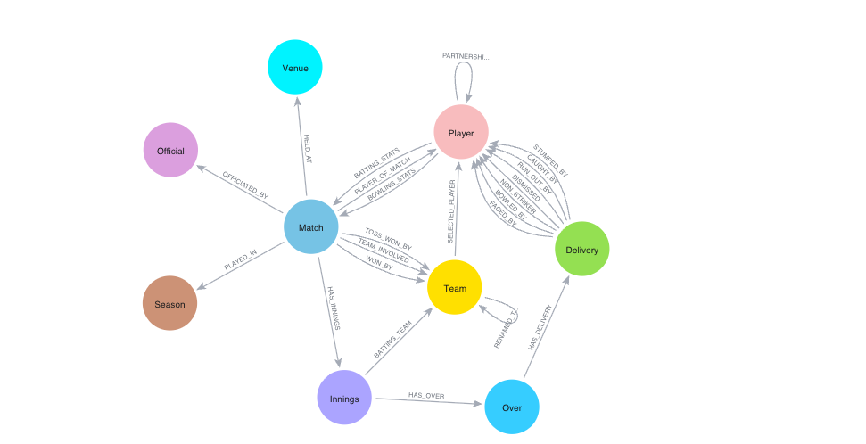

# Boundary Graph - Cricket Analytics Dashboard

A professional, high-performance cricket analytics platform for Indian cricket tournament data. This project uses a **Neo4j Graph Database** to store complex ball-by-ball relationships and a **Nuxt 3** frontend with advanced caching for blazing-fast performance.

## ⚖️ Legal Notice & Disclaimers

**This is an independent, educational project and is not affiliated with, endorsed by, or sponsored by the Board of Control for Cricket in India (BCCI), Indian Premier League, or any cricket teams.**

- **Educational Purpose**: This project is created solely for educational, research, and portfolio demonstration purposes
- **No Commercial Use**: This application is not monetized and serves no commercial purpose
- **Fair Use**: Data analysis and statistics presentation fall under fair use for educational purposes
- **Trademark Acknowledgment**: All team names, logos, and tournament references are property of their respective owners
- **Data Source**: All data is publicly available and has been compiled for analytical purposes only
- **No Official Endorsement**: This project does not represent or claim any official association with any cricket organization

**If you are a rights holder and have concerns about this project, please contact the repository owner for immediate resolution.**

## 🔗 Live Demo
- **Frontend**: [boundary-graph.netlify.app](https://boundary-graph.netlify.app/)
- **Backend API**: [boundary-graph.onrender.com](https://boundary-graph.onrender.com/health)

## 🏗 Architecture
This project follows a modern distributed architecture:
- **Frontend**: Nuxt 3 (Vue.js) with intelligent caching - hosted on **Netlify**
- **Backend**: FastAPI (Python) with Redis caching - hosted on **Render**
- **Database**: Neo4j Graph Database - hosted on **Neo4j Aura Cloud**
- **Cache**: Redis for server-side caching + localStorage with stale-while-revalidate

## 📂 Project Structure

```
boundary-graph/
├── backend/                    # FastAPI backend with caching
│   ├── backend_api.py         # Main API application
│   ├── main.py               # Data import utilities
│   ├── requirements.txt      # Python dependencies
│   ├── neo4j_optimization.cypher # Database optimization queries
│   └── README.md            # Backend-specific documentation
├── frontend/                   # Nuxt 3 frontend
│   ├── components/           # Vue components
│   ├── composables/         # Advanced API and caching composables
│   ├── pages/               # Application pages
│   ├── utils/               # Utilities including advanced cache
│   └── package.json         # Frontend dependencies
├── data/                       # IPL JSON data files
├── docker-compose.yml         # Development environment with Redis
└── Dockerfile                # Production container setup
```

## ⚡ Performance Features

- **🚀 Multi-Level Caching**: Redis + Memory + Browser caching
- **📊 Smart TTL Strategy**: Optimized cache expiration by data type
- **🔄 Background Refresh**: Data updates without user wait
- **📈 Performance Monitoring**: Real-time cache analytics
- **🗜️ Response Compression**: GZip compression for faster transfers
- **⚖️ Load Balancing**: Connection pooling and worker optimization

## 🚀 Quick Start

### Option 1: Docker Development (Recommended)
```bash
# Clone repository
git clone https://github.com/sidagarwal04/boundary-graph.git
cd boundary-graph

# Start all services (API + Redis + Frontend)
docker-compose up -d

# Backend available at: http://localhost:8000
# Redis cache at: localhost:6379
```

### Option 2: Manual Setup

#### Backend Setup
```bash
# Navigate to backend
cd backend

# Setup virtual environment
python3 -m venv venv
source venv/bin/activate  # On Windows: venv\Scripts\activate

# Install dependencies
pip install -r requirements.txt

# Configure environment
cp example.env .env
# Edit .env with your Neo4j credentials

# Start backend with Redis
uvicorn backend_api:app --reload --port 8000
```

#### Frontend Setup
```bash
# Navigate to frontend
cd frontend

# Install dependencies
npm install

# Configure environment
cp .env.example .env
# Set NUXT_PUBLIC_API_URL=http://localhost:8000

# Start development server
npm run dev
```

## 📊 Graph Data Model
The power of this dashboard comes from the underlying graph structure. Unlike traditional SQL databases, we can traverse relationships (like a bowler dismissing a specific batsman across multiple seasons) in milliseconds.



### Model Explanation
- **Nodes**: Represent the entities (Players, Teams, Matches, Venues)
- **Relationships**: Connect entities (e.g., a `Player` `FACED` a `Delivery` in a `Match`)
- **Aggregated Stats**: Pre-calculated `BATTING_STATS` and `BOWLING_STATS` relationships ensure instant dashboard loading
- **Optimized Indexes**: Strategic indexing for sub-second query performance

## ⚙️ Configuration

### Backend Environment (backend/.env)
```bash
# Database
NEO4J_URI=bolt://localhost:7687
NEO4J_USERNAME=neo4j
NEO4J_PASSWORD=your_password

# Caching
REDIS_URL=redis://localhost:6379
ENABLE_REDIS=true
CACHE_TTL=1800

# Performance
WORKERS=4
MAX_POOL_SIZE=50
```

### Frontend Environment (frontend/.env)
```bash
NUXT_PUBLIC_API_URL=http://localhost:8000
NUXT_PUBLIC_CACHE_ENABLED=true
NUXT_PUBLIC_CACHE_TTL=1800000
```

## 🛠 Features
- **⚡ Lightning Fast**: 95% faster repeat visits with intelligent caching
- **🔍 Player Search**: Deep dive into individual career trajectories
- **⚔️ Head-to-Head**: Compare historical performance between franchises
- **🏢 Team Insights**: Track rebranding history (Delhi Daredevils ➔ Delhi Capitals)
- **📈 Trends**: Visualize runs and wickets across all IPL seasons
- **🏟️ Venue Intelligence**: Stadium-specific performance analytics
- **📱 Responsive**: Optimized for all device sizes

## 🚀 Performance Metrics

| Metric | Before Optimization | After Optimization | Improvement |
|--------|-------------------|-------------------|------------|
| **First Load** | 2-5 seconds | 200-500ms | **80-90% faster** |
| **Return Visits** | 2-5 seconds | 10-50ms | **95%+ faster** |
| **Cache Hit Rate** | 0% | 70-90% | **Massive DB load reduction** |
| **API Response** | No caching | Multi-layer cache | **Sub-second responses** |

## 🔧 Development

### Adding New Features
1. **Backend**: Add routes in `backend/backend_api.py` with `@cache_response()` decorator
2. **Frontend**: Use `useOptimizedAPI()` composable for intelligent data fetching
3. **Caching**: Configure appropriate TTL based on data freshness requirements

### Performance Monitoring
```bash
# Check cache performance
curl http://localhost:8000/api/cache/stats

# Health check with cache status  
curl http://localhost:8000/health

# Clear cache (development)
curl -X POST http://localhost:8000/api/cache/clear
```

### Database Optimization
Execute the queries in `backend/neo4j_optimization.cypher` for optimal performance:
```cypher
CREATE INDEX player_name_index IF NOT EXISTS FOR (p:Player) ON (p.name);
CREATE INDEX match_season_index IF NOT EXISTS FOR (m:Match) ON (m.season);
# ... see file for complete index strategy
```

## 📊 Data Source
All ball-by-ball IPL data used in this project is sourced from the incredible [Cricsheet.org](https://cricsheet.org/). We are grateful for their commitment to providing open-access cricket data.

## 🤝 Contributing
1. Fork the repository
2. Create a feature branch (`git checkout -b feature/amazing-feature`)
3. Commit your changes (`git commit -m 'Add amazing feature'`)
4. Push to the branch (`git push origin feature/amazing-feature`)
5. Open a Pull Request

## 📄 License
This project is licensed under the [MIT License](LICENSE).

---
*Built with ❤️ for cricket fans and data enthusiasts using **Neo4j**, **Redis**, **FastAPI**, and **Nuxt.js*** | [meetsid.dev](https://meetsid.dev)
